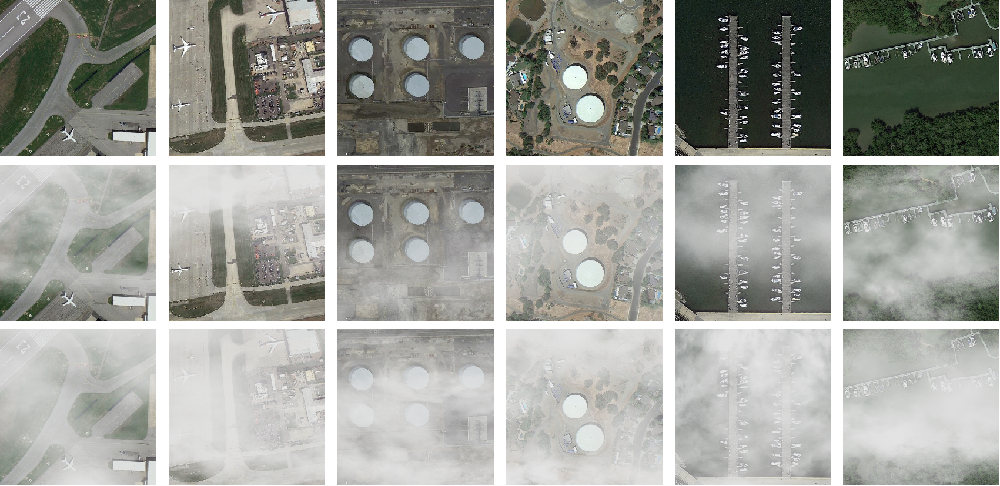

# FourierDehazeNet

This repository is the official pytorch implementation site for "FourierDehazeNet: Fourier-Domain Band Decomposition with Multi-Scale Feature Fusion for Remote Sensing Image Dehazing".

## RSHD

A sample of images from a portion of the RSHD dataset, covering airplanes, oil storage tanks, and ships. The first row shows haze-free images, the second row shows images with 1–2 layers of haze synthesized via AC-PHS by adding αn to the image, with αn randomly sampled in (0.75, 1.05), and the third row shows images with 2–3 layers of haze synthesized via AC-PHS by adding αn to the image, with αn randomly sampled in (0.85, 1.25) to simulate thicker and more non-uniform haze.For specific methods, please refer to **./utils/cloudmistfusion.py**

> **Academic Notice**: This paper is currently under consideration at a peer-reviewed conference/journal. To maintain the integrity of the review process, we are providing the model architecture and training code at this stage. The complete dataset and pre-trained weights will be released upon formal acceptance.

**Training Logs Availability**:  
We provide comprehensive training logs for the StateHaze1K dataset's three subsets as evidence of our experimental process:
- `./logs/thin.log` - Training metrics for thin haze conditions
- `./logs/moderate.log` - Training metrics for moderate haze conditions  
- `./logs/thick.log` - Training metrics for thick haze conditions

> *Note: Logs from other experimental runs were unfortunately purged during system maintenance before we could archive them systematically. The provided logs represent the complete and reproducible training processes for our main results.*

## Acknowledgment

This repository is heavily based upon [MixDehazeNet](https://github.com/AmeryXiong/MixDehazeNet) and [Dehazeformer](https://github.com/IDKiro/DehazeFormer).

This work was supported by the Key Research and Development Program of Heilongjiang Province.
